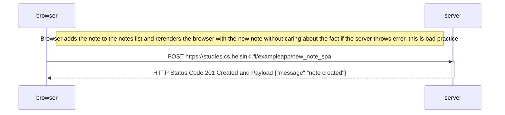

```mermaid

sequenceDiagram

    participant browser

    participant server

    Note right of browser: Browser adds the note to the notes list and rerenders the browser with the new note without caring about the fact if the server throws error. this is bad practice.
    browser->>server: POST https://studies.cs.helsinki.fi/exampleapp/new_note_spa
    activate server
    server-->>browser: HTTP Status Code 201 Created and Payload {"message":"note created"}
    deactivate server


```
